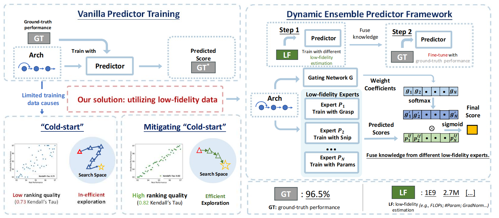

## Dynamic Ensemble of Low-fidelity Experts：Mitigating NAS Cold-Start 
--------
**DELE** is an easy-to-use library that provides the **dynamic ensemble architecture-performance predictor** in neural architecture search.

🎉 Intuition & Method 
-----------
Based on the intuition that "low-fidelity information can be beneficial for learning the modeling," DELE focuses on exploiting more information in other cheaper-to-obtain performance estimations (i.e., low-fidelity information) to mitigate the data requirements of predictor training. However, the types of low-fidelity information helpful for performance prediction are unclear to practitioners beforehand. In addition, different types of low-fidelity information could provide beneficial information from different aspects, but the naive method described above can only utilize one type of low-fidelity information.

To solve the problem, we propose a dynamic mixture-of-expert predictor framework to fuse beneficial knowledge from different low-fidelity experts. Specifically, as shown in the figure (Right) below, each low-fidelity expert is trained with one type of low-fidelity information (e.g., zero-shot evaluation scores, complexity scores, and so on). Then a dynamic ensemble of these experts is trained using only a small set of ground-truth performance data.



📖 Installation
-----------------
Run `pip install -r requirement.txt` to install the `dele` package.

🚀 Example
--------------
A dynamic ensemble predictor can be easily created with dele's API.

For example, a dynamic ensemble predictor with LSTM as the encoder on NAS-Bench-201 can be initialized as below.
```
    from dele.arch_embedder import NasBench201_LSTMSeqEmbedder
    from dele.arch_network import DynamicEnsemblePointwiseComparator

    predictor = DynamicEnsemblePointwiseComparator(
        arch_embedder_cls = NasBench201_LSTMSeqEmbedder, 
        arch_embedder_cfg = {"emb_hid": 100, "num_hid": 100, "num_layers": 1, "use_hid": True}, # configs for the embedder
        auxiliary_head_num = 10, # suppose we utilize 10 types of low-fidelity information
        compare_loss_type = margin_linear, # training loss type
        mlp_hiddens = (200, 200, 200),
        optimizer = {"lr": 0.001, "type": Adam}, # optimizer configs
        scheduler = None
    )
```
By inheriting the parent class ``dele.arch_embedder.ArchEmbedder``, you can implement new architecture encoders.

In addition, we provide training and validation API in ``dele.utils`` as well as dataset API in ``dele.dataset``.

A tutorial on NAS-Bench-201 is provided under ``./example``. Please check ``./example/README.md`` for details.

👍 Contributions
-----------------
We welcome contributions of all kind.
